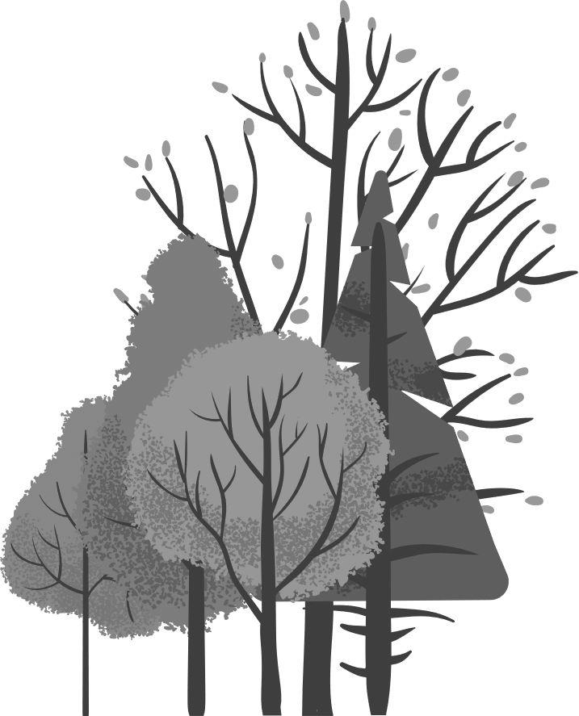
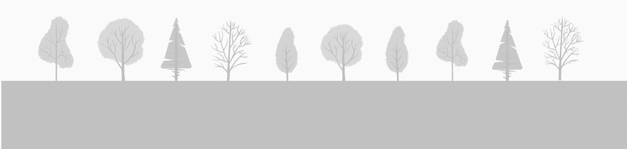

---
# Pandoc header, everything that is inserted here is only for the computer to know what and how to compile the output. 
title: |
  {width=1.95in}  
  {width=1.2in}  
  {width=1.2in}  
  {width=7.75in}  
  Regional report on complex forest characterization with NFI  
shorttitle: 'Informe para el proyecto COMFORT-SUDOE'  
author: "Cristóbal Ordóñez, Irene Arroyo & Felipe Bravo"  
date: |
  "`r Sys.Date()`"  
  ·  
  {width=2in}  
  {width=2in}
linestretch: 1.5                 # get some spacing between the lines you write
bibliography: report.bib         # this is your bibliography file... it can be exported with Zotero, Medeley...
biblio-style: apalike            # citations style
link-citations: yes              # make your links clickable
output:
  word_document:
    reference_docx: "./config/template.docx"
    number_sections: true        # chapters will be assigned numbers automatically
    fig_caption: yes
## always_allow_html: true
documentclass: book
header-includes:
  - \usepackage{float}
  - \usepackage{longtable}
  - \usepackage[spanish]{babel}
  - \usepackage{eurosym}
#  - \floatsetup[table]{capposition=top}
---

\tableofcontents

# Introducción y marco del informe
En el presente informe se muestra el resultado de la valoración económica de diversas alternativas selvícolas planteadas para masas de *Pinus pinaster* en el marco del proyecto del Grupo Operativo SIGCA para madera de calidad de esta especie.

```{r setup, include=FALSE}
## before you compile the document. This may show additional messages to help you debug the problem. If you are using R Markdown and the Knit button in RStudio, you should set the option in a code chunk in the R Markdown document.
options(tinytex.verbose = TRUE)

## setup options and library loading
knitr::opts_chunk$set(echo = FALSE, cache=FALSE)

libraries <- c('pander','ggplot2','reshape2','ggforce','tidyr','viridis','plotly','stringr')
lapply(libraries, library, character.only=TRUE)
panderOptions('table.alignment.default', 'right')
panderOptions('table.alignment.rownames', 'left')

## colors
# The palette with grey:---->>>> cbPalette <- c("#999999", "#E69F00", "#56B4E9", "#009E73", "#F0E442", "#0072B2", "#D55E00", "#CC79A7")
# The palette with black:---->>>> cbbPalette <- c("#000000", "#E69F00", "#56B4E9", "#009E73", "#F0E442", "#0072B2", "#D55E00", "#CC79A7")
# To use for fills, add: ---->>>> scale_fill_manual(values=cbPalette)
# To use for line and point colors, add: ---->>>> scale_colour_manual(values=cbbPalette)
## colors
```

# Objetivos

```{r img.pinaster, fig.align='center', out.width="750px"}
#knitr::include_graphics("./imagenes/pinares_92f650725ebb0a7b902f15aebd658059.jpg")
```

El objetivo principal de este entregable es describir la evolución de las masas complejas a lo largo de las distintas ediciones del Inventario Forestal Nacional Español. Para ello se presentarán distintos gráficos y mapas con las combinaciones de especies y porcentajes que representan.

# Masas mixtas

------- breve intro --------

```{r read.data.comb, include=FALSE}
## read simulation data
rm(list=ls())
## options(width=280)
## setwd('../data')
dir <- '../data/'
dir_mixt <- '../data/mixtures/'
## Leemos los datos
## setwd("C:/Users/Irene/Documents/INF COMFOR/Entrega/Combi")
combiIFN2<-read.table(paste0(dir_mixt,"combinaciones.if2.txt"))
combiIFN3<-read.table(paste0(dir_mixt,"combinaciones.if3.txt"))
combiIFN4<-read.table(paste0(dir_mixt,"combinaciones.if4.txt"))
```

## Gráficas por edición

A continuación se muestra las gráficas con el número de ocurrencias de las combinaciones de especies presentes en cada edición del IFN. 


```{r plot.comb.01}

## seleccion de las combinaciones de especies más numerosas
combiIFN2_30<-combiIFN2[combiIFN2$Freq>30,]
combiIFN3_30<-combiIFN3[combiIFN3$Freq>30,]
combiIFN4_30<-combiIFN4[combiIFN4$Freq>30,]
graficoIndividual<-function(datos,IFN){
  ggplot(data=datos, aes( y=Freq, x=Var1 )) +
    geom_bar(stat = "identity", color = "lightgreen") +
    theme_grey()+
    theme(axis.text.x = element_text(angle = 90, hjust = 1))+ 
    labs(title=paste0("Combinaciones mas frecuentes en el ",IFN))
}
###################################IFN2#########################################
graficoIndividual(combiIFN2_30,"IFN2")
###################################IFN3#########################################
graficoIndividual(combiIFN3_30,"IFN3")
###################################IFN4#########################################
graficoIndividual(combiIFN4_30,"IFN4")
```

## Gráfica conjunta

A continuación se muestra la gráfica conjunta para las combinacines de especies en las que haya al menos mas de 90 ocurrencias en las dos primeras ediciones y 40 en la cuarta edición. Se ha puesto un límite menor en esta última edición porque no está disponible para todo el territorio.


```{r plot.comb.02}
combiIFN2_90<-combiIFN2[combiIFN2$Freq>90,]
combiIFN3_90<-combiIFN3[combiIFN3$Freq>90,]
combiIFN4_40<-combiIFN4[combiIFN4$Freq>40,]

combi<-rbind(combiIFN2_90,combiIFN3_90,combiIFN4_40)
combi$IFN<-c(rep('IFN2',dim(combiIFN2_90)[1]),rep('IFN3',dim(combiIFN3_90)[1]),rep('IFN4',dim(combiIFN4_40)[1]))

ggplot(combi,aes(x=Var1,y=Freq,fill=factor(IFN)))+
  geom_bar(stat="identity",position = "dodge")+
  #geom_text(aes(label = Cont), vjust = -0.5) +
  labs(title = "Combinaciones más frecuentes",
       x = "Combinaciones",
       y = "Repeticiones",
       fill="INF") +
  theme_minimal()+
  theme(axis.text.x = element_text(angle = 90, hjust = 1))

```

# Evolución del IFN en conjunto
### Funciones
```{r evolucion IFN}
library(ggplot2)
library(plotly)

numPlotsIF<-function(setwd,id){
  plotsMonoSP<-read.csv(paste0(setwd,'/of_if',as.character(id),'_plotsMonoSP.csv'), row.names = 1)
  plotsPluri<-read.csv(paste0(setwd,'/of_if',as.character(id),'_plotsPluriSP.csv'),row.names=1)
  resultMD<-read.csv(paste0(setwd,'/of_if',as.character(id),'_resultHeightPlurimodal.csv'), row.names = 1)
  resultMDiamF<-read.csv(paste0(setwd,'/of_if',as.character(id),'_resultDiamPlurimodal.csv'), row.names = 1)
  
  ## Monoespecificas
  nMono<-dim(plotsMonoSP)[1]
  
  ## Pluriespecifica
  nPluriEsp<-dim(plotsPluri)[1]
  
  ## Modalidad
  resultMModal <- merge( resultMD, resultMDiamF, by='PlotID', all=T)
  positionPluri <- which( ( as.numeric(resultMModal$Pvalor.x) < 0.05 ) & ( as.numeric(resultMModal$Pvalor.y) < 0.05 ) )
  plotsPluriMod <- resultMModal[ positionPluri, ]
  nPlurimod<-dim(plotsPluriMod)[1]
  
  tipo<-c("Monoespecifica","Plurimodal","Pluriespecifica")
  num<-c(nMono,nPlurimod,nPluriEsp)
  id<-rep(id,3)
  datosT<-data.frame(id,num,tipo)
  return(datosT)
}
```

### Representación
```{r representacion evol}
####################################IFN2########################################
datosT2<-numPlotsIF(setwd=dir,2);datosT2

####################################IFN3########################################
datosT3<-numPlotsIF(setwd=dir,3);datosT3

####################################IFN4########################################
datosT4<-numPlotsIF(setwd=dir,4);datosT4

################################BARRAS APLIADAS#################################
## Juntamos los datos
datosT<-rbind(datosT2,datosT3,datosT4)

ggplot(datosT,aes(x=tipo,y=num,fill=factor(id)))+
  geom_bar(stat="identity")

```

# Evolución del IFN por CCAA    
### Funciones
```{r EVOL por CCAA}
dir <- './data/'
dir(path=dir)

numPlotsIFCCAA<-function(setwd,id){
  plotsMonoSP<-read.csv(paste0(setwd,'of_if',as.character(id),'_plotsMonoSP.csv'), row.names = 1)
  plotsPluri<-read.csv(paste0(setwd,'/of_if',as.character(id),'_plotsPluriSP.csv'),row.names=1)
  resultMD<-read.csv(paste0(setwd,'/of_if',as.character(id),'_resultHeightPlurimodal.csv'), row.names = 1)
  resultMDiamF<-read.csv(paste0(setwd,'/of_if',as.character(id),'_resultDiamPlurimodal.csv'), row.names = 1)
  
  comunidades<-function(datos){
    origen<-c()
    for(i in 1:dim(datos)[1]){
      prov<-strsplit(datos$PlotID[i],split = "\\.")[[1]][1]
      prov<-trimws(prov)
      origen<-c(origen,prov)
    }
    datos$Origen<-origen
    
    datos$CCAA<-with(datos,ifelse(Origen=="4" | Origen=="11" | Origen=="14"| Origen=="18" | Origen=="21"| Origen=="23"| Origen=="29"| Origen=="41" ,"Andalucia",0))
    datos$CCAA<-with(datos,ifelse(Origen=="22" | Origen=="44" | Origen=="50","Aragon",CCAA))
    datos$CCAA<-with(datos,ifelse(Origen=="33","Asturias",CCAA))
    datos$CCAA<-with(datos,ifelse(Origen=="7","Baleares",CCAA))
    datos$CCAA<-with(datos,ifelse(Origen=="35" | Origen=="38" ,"Canarias",CCAA))
    datos$CCAA<-with(datos,ifelse(Origen=="39","Cantabria",CCAA))
    datos$CCAA<-with(datos,ifelse(Origen=="5" | Origen=="9" | Origen=="24"| Origen=="34"| Origen=="37"| Origen=="23"| Origen=="40"| Origen=="42" | Origen=="47" | Origen=="49" ,"CastillaLeon",CCAA))
    datos$CCAA<-with(datos,ifelse(Origen=="4" | Origen=="2" | Origen=="13"| Origen=="16"| Origen=="19"| Origen=="45","CastillaLaMancha",CCAA))
    datos$CCAA<-with(datos,ifelse(Origen=="8" | Origen=="17" | Origen=="25"| Origen=="43" ,"Cataluña",CCAA))
    datos$CCAA<-with(datos,ifelse(Origen=="3" | Origen=="12" | Origen=="46" ,"ComunidadValenciana",CCAA))
    datos$CCAA<-with(datos,ifelse(Origen=="6" | Origen=="10" ,"Extremadura",CCAA))
    datos$CCAA<-with(datos,ifelse(Origen=="15" | Origen=="27" | Origen=="32" | Origen=="36" ,"Galicia",CCAA))
    datos$CCAA<-with(datos,ifelse(Origen=="28","Madrid",CCAA))
    datos$CCAA<-with(datos,ifelse(Origen=="30","Murcia",CCAA))
    datos$CCAA<-with(datos,ifelse(Origen=="31","Navarra",CCAA))
    datos$CCAA<-with(datos,ifelse(Origen=="1" | Origen=="48" | Origen=="20","PaisVasco",CCAA))
    datos$CCAA<-with(datos,ifelse(Origen=="26","LaRioja",CCAA))
    
    return(datos)
  }
  
  tipo<-c("Monoespecifica","Pluriespecifica","Plurimodal")
  
  ## Monoespecificas
  plotsMonoSP<-comunidades(plotsMonoSP)
  nMonoCCAA<-as.data.frame(table(plotsMonoSP$CCAA))
  colnames(nMonoCCAA)<-c("CCAA","Cont")
  nMonoCCAA$Tipo<-tipo[1]
  
  ## Pluriespecifica
  plotsPluri<-comunidades(plotsPluri)
  nPluriCCAA<-as.data.frame(table(plotsPluri$CCAA))
  colnames(nPluriCCAA)<-c("CCAA","Cont")
  nPluriCCAA$Tipo<-tipo[2]

  ## Modalidad
  resultMModal <- merge( resultMD, resultMDiamF, by='PlotID', all=T)
  positionPluri <- which( ( as.numeric(resultMModal$Pvalor.x) < 0.05 ) & ( as.numeric(resultMModal$Pvalor.y) < 0.05 ) )
  plotsPluriMod <- resultMModal[ positionPluri, ]
  plotsPluriMod<-comunidades(plotsPluriMod)
  nPluriModCCAA<-as.data.frame(table(plotsPluriMod$CCAA))
  colnames(nPluriModCCAA)<-c("CCAA","Cont")
  nPluriModCCAA$Tipo<-tipo[3]
  
  datos<-rbind(nMonoCCAA,nPluriCCAA,nPluriModCCAA)
  datos$id<-rep(id,dim(datos)[1])
  datosCCAA<-datos
  return(datosCCAA)
}

### Representación
####################################IFN2########################################
datosCCAA2<-numPlotsIFCCAA(setwd=dir,2);datosCCAA2

####################################IFN3########################################
datosCCAA3<-numPlotsIFCCAA(setwd=dir,3);datosCCAA3

####################################IFN4########################################
datosCCAA4<-numPlotsIFCCAA(setwd=dir,4);datosCCAA4

###########################BARRAS MULTIPLES#####################################
datosCCAA<-rbind(datosCCAA2,datosCCAA3,datosCCAA4)

## MONOESPECIFICAS
datosCCAAMono<-datosCCAA[datosCCAA$Tipo=="Monoespecifica",]


ggplot(datosCCAAMono,aes(x=CCAA,y=Cont,fill=factor(id)))+
  geom_bar(stat="identity",position = "dodge")+
  #geom_text(aes(label = Cont), vjust = -0.5) +
  labs(title = "Parcelas Monoespecificas",
       x = "Comunidad",
       y = "Contador",
       fill="INF") +
  theme_minimal()

## PLURIESPECIFICAS
datosCCAAPluri<-datosCCAA[datosCCAA$Tipo=="Pluriespecifica",]

ggplot(datosCCAAPluri,aes(x=CCAA,y=Cont,fill=factor(id)))+
  geom_bar(stat="identity",position = "dodge")+
  #geom_text(aes(label = Cont), vjust = -0.5) +
  labs(title = "Parcelas Pluriespeficas",
       x = "Comunidad",
       y = "Numero",
       fill="INF") +
  theme_minimal()

## PLURIMODALES
datosCCAAPluriMod<-datosCCAA[datosCCAA$Tipo=="Plurimodal",]

ggplot(datosCCAAPluriMod,aes(x=CCAA,y=Cont,fill=factor(id)))+
  geom_bar(stat="identity",position = "dodge")+
  #geom_text(aes(label = Cont), vjust = -0.5) +
  labs(title = "Parcelas Plurimodal",
       x = "Comunidad",
       y = "Numero",
       fill="INF") +
  theme_minimal()
```

# Mapas de representación por tipo de parcela

```{r read.data.map, include=FALSE}
## read simulation data
rm(list=ls())
## options(width=280)
## setwd('../data')
dir <- '../data/'
## Leemos los datos
## setwd("C:/Users/Irene/Documents/INF COMFOR/Entrega/Combi")
combiIFN2<-read.table(paste0(dir,"combinaciones.if2.txt"))
combiIFN3<-read.table(paste0(dir,"combinaciones.if3.txt"))

las distintas ediciones para cada comunidad autónomas 

# Referencias
