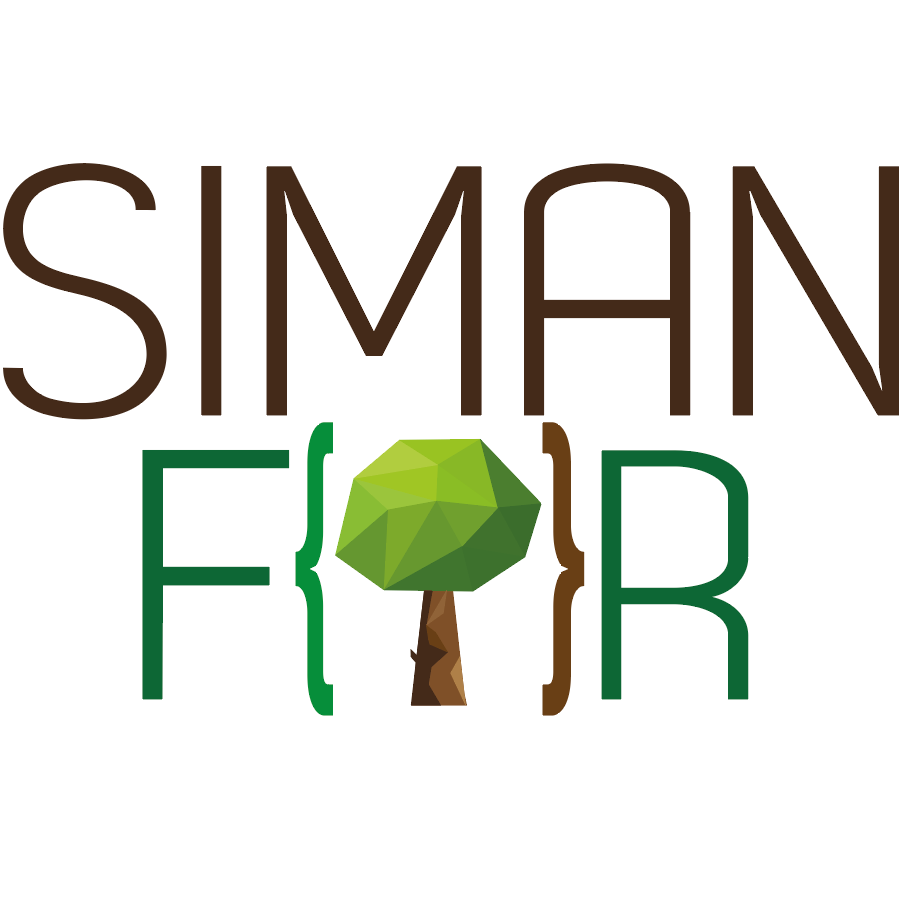

---
# Pandoc header, everything that is inserted here is only for the computer to know what and how to compile the output. 
title: |
  {width=1.5in}  
  Regional report on complex forest characterization with NFI_  
shorttitle: 'Informe para el proyecto COMFORT-SUDOE'  
author: "Cristóbal Ordóñez, Irene Arroyo & Felipe Bravo"  
date: |
  "`r Sys.Date()`"  
  ·  
  {width=2in}  
  {width=2in}
linestretch: 1.5                 # get some spacing between the lines you write
bibliography: report.bib         # this is your bibliography file... it can be exported with Zotero, Medeley...
biblio-style: apalike            # citations style
link-citations: yes              # make your links clickable
output:
  word_document:
    ## reference_docx: "./config/template.docx"
    number_sections: true        # chapters will be assigned numbers automatically
    fig_caption: yes
documentclass: book
header-includes:
  - \usepackage{float}
  - \usepackage{longtable}
  - \usepackage[spanish]{babel}
  - \usepackage{eurosym}
---

\tableofcontents

# Intro
En el presente informe se muestra el resultado de la valoración económica de diversas alternativas selvícolas planteadas para masas de *Pinus pinaster* en el marco del proyecto del Grupo Operativo SIGCA para madera de calidad de esta especie.

# Cap 1

	En el presente informe se muestra el resultado de la valoración económica de diversas alternativas selvícolas planteadas para masas de *Pinus pinaster* en el marco del proyecto del Grupo Operativo SIGCA para made de calidad de esta especie.

# Cap 2

## Int

### rodu

#### cción

#### y marco del informe

# Cap 3

## Int

### rodu

#### cción

#### y marco del informe

# Cap 4

## Int

### rodu

#### cción

#### y marco del informe

# Cap 5

## Int

### rodu

#### cción

#### y marco del informe
